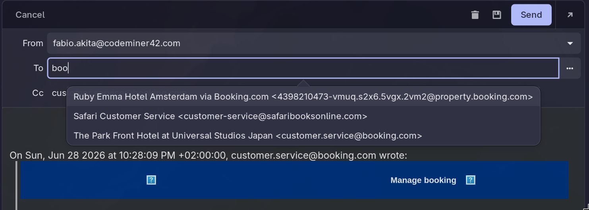

FrankGeary
==========


FrankGeary is a fork of the [GNOME Geary](https://gitlab.gnome.org/GNOME/geary)
email client that carries a small set of workflow improvements which are not
available upstream. The changes are maintained as native Vala patches on top of
current upstream Geary, kept deliberately small so the fork can track upstream
releases closely.

These improvements started life as two standalone GTK3 modules —
`geary-email-autocomplete` and `geary-hide-sidebar` — that injected the same
behavior into stock Geary at runtime via `GTK_MODULES`, patched launchers, and
pacman hooks. That approach worked without forking Geary, but it depended on
Geary's private widget internals and launcher files. FrankGeary replaces all of
that machinery with proper native implementations.

Features
--------

### Wider recipient autocomplete

Geary has built-in composer autocomplete, but stock Geary only suggests
contacts above a high importance threshold, so many legitimate senders you have
already seen never appear. FrankGeary lowers the visibility threshold to
`SEEN`, suggesting anyone whose mail has reached your inbox, while a
conservative filter drops `noreply`/`donotreply` addresses so machine senders
don't pollute the list.



### Copy Image in the message viewer

Right-clicking an image already loaded in a message offers WebKitGTK's stock
**Copy Image** action, so you can paste images from emails directly into other
applications.

### Folder sidebar toggle (<kbd>Ctrl</kbd>+<kbd>Shift</kbd>+<kbd>M</kbd>)

The left "Mail" column (the account/folder list) takes up a big slice of a
narrow window, and upstream Geary offers no way to hide it — the ability has
been requested several times over the years without being addressed. FrankGeary
adds a keyboard toggle; the state is persisted in GSettings
(`folder-list-sidebar-visible`) across restarts.

<table>
<tr>
<td width="50%" align="center">

**Sidebar shown** — the folder list takes a big slice of a narrow window.


</td>
<td width="50%" align="center">

**Sidebar hidden** — all the width goes to the message list and reading pane.
Toggle back any time with <kbd>Ctrl</kbd>+<kbd>Shift</kbd>+<kbd>M</kbd>.


</td>
</tr>
</table>

> Email addresses in the screenshots are placeholders.

Installing on Arch Linux (AUR)
------------------------------

```sh
yay -S frank-geary        # builds from source
yay -S frank-geary-bin    # prebuilt x86_64 binary from the GitHub Release
```

Both packages provide and conflict with `geary`, replacing it as your Geary
installation. The binary package installs the exact install tree built by this
repository's release workflow.

After an install or upgrade, make sure no stale Geary process is still running
in the background (Geary keeps running as a D-Bus service when "Watch for new
mail when closed" is enabled):

```sh
geary --quit
```

Building
--------

FrankGeary builds exactly like Geary: see [BUILDING.md](./BUILDING.md).

```sh
meson setup build -Dprofile=development
meson compile -C build
./build/src/geary
```

Tracking upstream
-----------------

FrankGeary tracks GNOME Geary `main` closely; the fork-specific patches are
kept small and separated by feature so upstream updates integrate cleanly. See
[docs/upstream-updates.md](./docs/upstream-updates.md) for the update workflow.

FrankGeary-specific issues belong in this GitHub repository. Bugs that also
reproduce in unmodified Geary should be reported
[upstream](https://gitlab.gnome.org/GNOME/geary/-/issues).

License
-------

FrankGeary is distributed under the same license as GNOME Geary:
[LGPL 2.1 or later](./COPYING). See [COPYING](./COPYING) and
[COPYING.icons](./COPYING.icons) for details.

---
Copyright © 2016 Software Freedom Conservancy Inc.
Copyright © 2017-2020 Michael Gratton <mike@vee.net>
